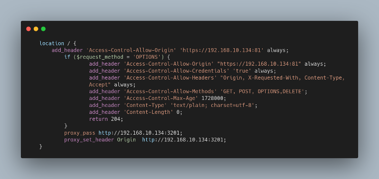

# nginx_config_reverse_proxy_ssl

<h1>OverView</h1>

This Repository is a simple implementation of a reverse proxy and https configuration of self signed certificates as well as instructions to handle the preflight problem of react and 'Access-Control-Allow-Origin'.

Kudos for  `ChristianLempa` at https://github.com/ChristianLempa/cheat-sheets/blob/c199f41e121e71a96e45a3a4bb2921dfedb35348/misc/ssl-certs.md for providing an easy to use repo for creating self signed certs. 

## When To Use

- Home setup and u don't want to buy a domain but u want https traffic
- Perform A stack of security on the nginx instead of the website
- Configure react to connect to ur backend through nginx

## Dependencies
- OpenSSL using `https://github.com/ChristianLempa/cheat-sheets/blob/c199f41e121e71a96e45a3a4bb2921dfedb35348/misc/ssl-certs.md`
- Docker
- Docker-Compose
- Portainer(better to have)

<h2>Usage</h2>
> create Self Signed certs using link above and put in cert folder

> docker-compose up -d inside the shell

<h2>Reverse Proxy Only</h2>

## Watch out for
- Always set it up as the last step after finishing development
- If u Have 2 services that requires port 80, remember to change the port number of the docker compose inside the docker daemon and in the outside host 
  port : 81:81
